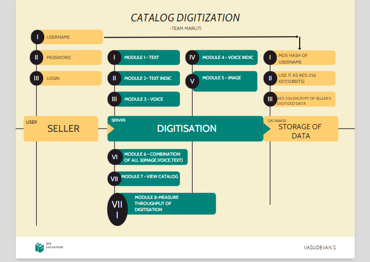
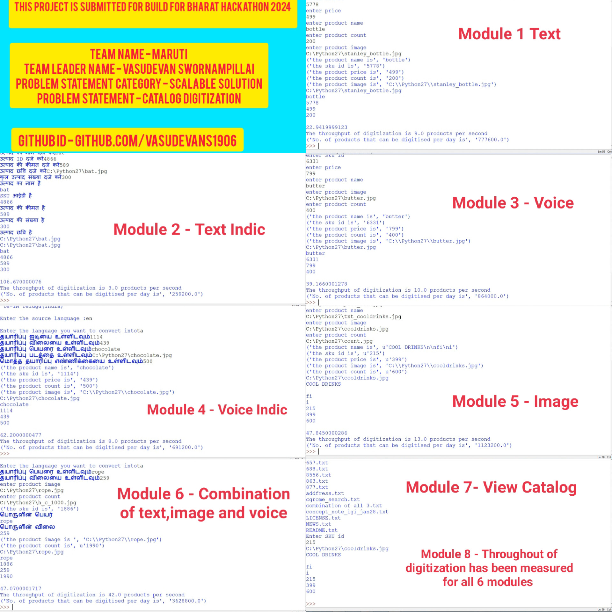

# BAGIT Catalog Digitization

A catalogue is the best option if we want a thorough explanation of our company's goods and services. It is a very helpful advertising tool that has a lot of potential to encourage our clients to buy products or hire services.Still, some businesses use hardcopy catalogues as part of their strategy, and they continue to yield positive outcomes. However, the scope of this kind of publication will constantly be expanded by developing a digital catalogue.

**Scope** :- The scope of this project is to digitize catalogs using text,image and audio interfaces , while also accomplishing the mechanism for measuring the throughput of digitization.

**Functionalities** :- The project is divided into eight different core functionalities each of which is a potential module. 

# Demo Video 

The demo video of the results are attached below, 

[![Watch the video]](demo_video.mp4)

# Full Video - Youtube Link 

The complete video with all the test links has been uploaded to **YOUTUBE** and the link is as follows,

https://www.youtube.com/watch?v=EsMQC_ZSMaA

# News 

- Currently the project has been implemented in Python 2.7 IDLE , by using Django framework it will be deployed in AWS as a website soon.

# Prerequisite

1.Install the Python 2.7 & Django web framework

2.Understanding of translation and playsound functions of gTTS(Google Text To Speech) library.

3.Familiarity with optical Character Recognition(OCR)

4.Knowledge of building models with OCR using PyTesseract

5.Understanding Catalog Digitization using Text,Audio & Image formats.

# How to Install

Follow these simple steps to get started with our Catalog Digitization tool:

**Clone the Repository**:

### git clone https://github.com/your-username/catalog-digitization.git

### cd catalog-digitization

# Modules 

The project has been divided into 8 modules which are as follows, 
1. Text mode digitization
2. Text Indic mode digitization
3. Voice mode digitization
4. Voice indic mode digitization
5. Image mode digitization
6. Combination of all 3(text,voice & image) mode digitization
7. View Digitized Catalogs
8. Measuring the Throughput of Digitization

# Workflow Diagram

The workflow diagram for the project is picturized as follows,

# Module 1

**Text**

- Catalog digitisation in the form of text is achieved in this module . It receives the input from the user in text form and saves them in the database and digitizes the catalog with the use of parameters like SKU id,product name,brand,colour ,price,etc.,

# Module 2

**Text Indic**

- Catalog digitization in the form of indic languages text is achieved in this module . It receives the input from the user in their respective indic languaes as text form and saves them in the database and digitizes the catalog with the use of parameters like SKU id,product name,brand,colour ,price,etc., 

# Module 3

**Voice**

- Catalog digitization in the form of voice(audio) is achieved in this module . It receives the input from the user in the audio format and converts it as text by using Speech-To-Text and saves them in the database and digitizes the catalog with the use of parameters like SKU id,product name,brand,colour ,price,etc., 

# Module 4

**Voice Indic**

- Catalog digitization in the form of indic languages of voice(audio) is achieved in this module . It receives the input from the user in their respective indic languaes as audio(voice) form & converts it into text using Speech-To-Text and saves them in the database and digitizes the catalog with the use of parameters like SKU id,product name,brand,colour ,price,etc., 

# Module 5

**Image**

- Catalog digitization in the form of images is achieved in this module . It receives the input from the user in the image format and converts it to text form using Optical Character Recognition(OCR) saves them in the database and digitizes the catalog with the use of parameters like SKU id,product name,brand,colour ,price,etc., 

# Module 6

**Combination of all 3**

- Catalog digitization in the form of combination of all three (image , voice and text) is achieved in this module . For example ,It receives the input from the user  for product image & name in image format , description in voice format and price in text fromat and saves them in the database and digitizes the catalog with the use of parameters like SKU id,product name,brand,colour ,price,etc., 

# Module 7 

–Here we can view the catalog from a list of previously created files & see the results of digitilization of our catalog.

# Module 8 

– The mechanism of throughput digitization can be done by finding out the speed with which individual products are digitized . After the result of each module code is added to print the result of throughput of digitization in each module in the unit of seconds and also calculating the total number of products that can be digitized in a day.The throughput of digitization can be found out by using the formula , 
        
        ## Throughput of digitization = (Total number of products to be digitized)/(Time taken to digitize the total products)

# Additional Features of this model

**Dependencies** :- The 7th and 8th module are interdependent on the first 6 modules . While the first 6 modules are interdependent on each other

**Feasibilty** :- While the first 6 modules are independent of each other , the 7th and 8th module depends on the first 6 modules. 

**Prioritize** :- We should priortize in making the fisrt 6 modules in the order of 1-3-5-2-4-6 . Because first we should accompish main interfaces first then we can make them into indic and combination of all three

**Inputs & Outputs** :- While the Module 1&2 gets the input in text format , module 3 & 4 receives it in audio format(mp3/4) , module 5 take it up in image format(jpeg/png) , module 6 takes it up in combination of all 3 (image , audio and text) , but the output of all the three turns out to be in text format

**Tech evaluation**:-

Each module’s behavior is unique as it receives request from user it accepst the request and implements the module behavior withotu any error. The modules are error free dut to consistent naming conventions and documented interfaces which provides clear understanding of how each modules work  

**Reusability** – All Modules are independently deployable units for algorithms it can be reused without the worry of identifying which additional modules might be necessary.

**Extensibility**:- The project has a built in ability which enables it to add differentiating feature and extend it in modular fashion.

**Scalability** – You can type in the values in the respective fields of each module and the modular system allows you to effectivley implement and adapt to the changing needs of each individual products for selling.

**Security** – The retail data are encrypted with AES-256 standard encryption algorithm which encrypts your datas with a key.The key is md5 hashed(since key input size is 128 bits ) . So the modules deliver transactional guarantees for the retail sellers who are digitizing their catalog of products in retail industry.

# Deployment

Customization deployment for the proposed solution of catalogue digitization is done using a 
Live Web App

Programming Language – **Python 2.7.18**

Web Freamework - **Django 1.11.2**

Database – **Amazon Web Services(AWS)**

# The Test Cases & Results

**The eight test cases** required for the catalog digitisation are as follows : 

Text mode digitization
Text indic mode digitization
Voice mode digitization
Voice indic mode digitization
Image mode digitization
Combination of all three(Image,text & voice) mode digitisation
View digitized catalogs
Mechanism to measure the throughput of digitisation 

The first 6 test cases can be evaluated by the Program gathering data from user and saving it
successfully in the database. Test case no.7 is assessed using hoow it can retrieve data from
Database and show it to the user . 
Test case no.8 is evaluated using how it can measure the
**throughput of digitization by figuring out the total time taken for digitizing the total number of products.**   

The results of the  eight test cases has been attached below in the form of a collage,

# User Authentication

Each indivual users are required to create an username and their passwords are hashed with **BLAKE-512** and stored in the database. 

# Data Storage Algorithm

Each digitized data is encrypted with **AES-256** algorithm to encrypt the data into 128 bits. To encrypt the data the Users SKU ID is hashed with MD5 algorithm which is then used as a key for AES-256 algorithm. The final encrypted data is stored in the database.

# Tech Stack

 **Language** - Python 2.7.18

 **Web Framework** - Django 1.11.2

# Under Deployment

- A completely functional website launched utilising the Django and AWS framework.

# Share with the community

If you find this project interesting or helpful, don't hesitate to share with your community! Let's learn and grow together! 

# Contribution

We welcome contributions from the community! Whether you're a seasoned developer, a data science enthusiast, or a domain expert, your insights and expertise can enhance our project.

# Conclusion 

In this project, we’ve developed a robust solution for Digitizing catalogue. The model, a beacon of performance, awaits those go into the beautiful world of Python.

